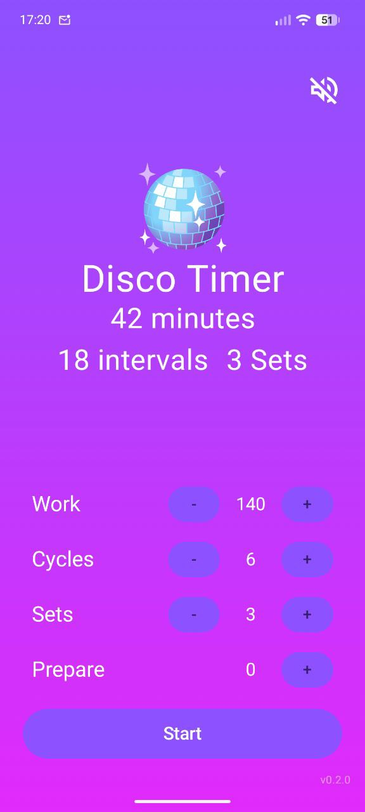
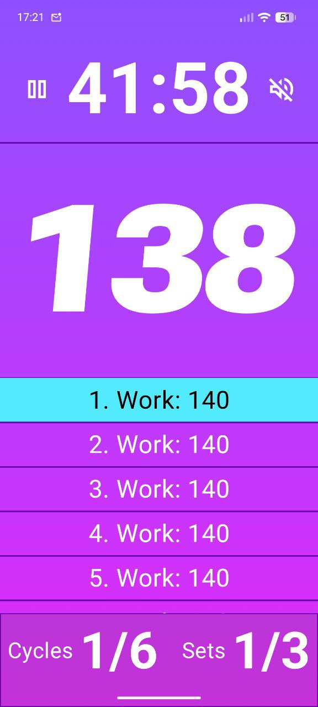

# Disco Timer

A native Android workout interval timer built with Kotlin and Jetpack Compose.

## Screenshots

<p align="center">
  
  
</p>

## Features

- Workout interval timer with configurable work periods, cycles, and sets
- Prepare countdown before the timer starts
- Sound notifications and vibration feedback
- Mute/unmute toggle
- Pause/resume
- Screen stays awake during the timer
- Settings persisted across sessions
- Back button confirmation dialog

## Tech Stack

- **Language**: Kotlin
- **UI**: Jetpack Compose + Material 3
- **Architecture**: MVVM with StateFlow
- **Navigation**: Jetpack Navigation Compose
- **Persistence**: DataStore Preferences
- **Min SDK**: 24 (Android 7.0)
- **Target SDK**: 34 (Android 14)

## Project Structure

```
app/src/main/java/com/anonymous/discotimer/
├── MainActivity.kt
├── data/
│   ├── TimerState.kt              # State data class with computed properties
│   └── TimerPreferences.kt        # DataStore persistence
├── viewmodel/
│   └── TimerViewModel.kt          # Timer logic, audio, vibration
├── ui/
│   ├── components/                # InputRow, WorkTimer, ScrollTimer, etc.
│   ├── screens/                   # Form, Active timer, Completed
│   ├── navigation/                # Navigation graph
│   └── theme/                     # Colors, Theme, Typography
└── utils/
    └── TimeFormatter.kt
```

## Build

```bash
# Debug build
./gradlew assembleDebug

# Install on connected device/emulator
./gradlew installDebug

# Release build (unsigned)
./gradlew assembleRelease
```

APK outputs are in `app/build/outputs/apk/`.

## Usage

1. **Configure** - Set work duration, cycles, sets, and optional prepare time
2. **Start** - Press Start to begin the countdown
3. **Control** - Tap the countdown or pause icon to pause/resume; toggle mute anytime
4. **Complete** - A finish sound plays and a celebration screen appears

## Permissions

- `WAKE_LOCK` - Keep screen on during timer
- `VIBRATE` - Feedback on countdown and completion

## License

MIT
