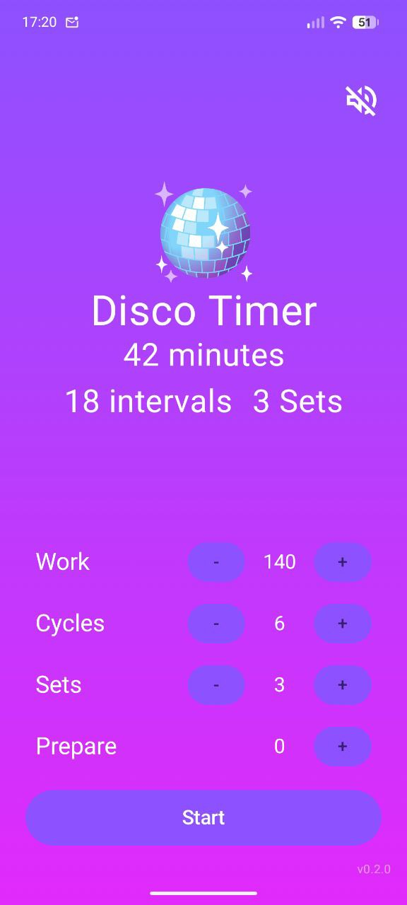
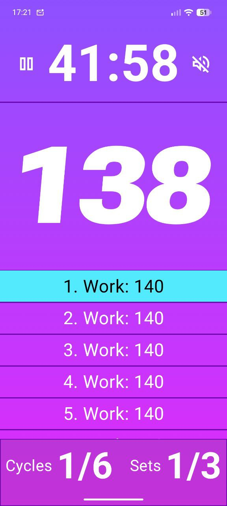

# Disco Timer

A native Android workout interval timer built with Kotlin and Jetpack Compose.

🪩 Disco Timer is a workout interval timer that does one thing well: it counts
your intervals out loud so you can keep your eyes on your workout instead of
your phone.

No account. No ads. No tracking. No internet connection required.

SET UP IN SECONDS
Four numbers and you're training:
• Work — how long each interval lasts
• Cycles — how many intervals per set
• Sets — how many times to repeat
• Prepare — an optional countdown before the first interval

The total workout time and interval count update as you type, so you know
exactly what you're in for before you press Start. Your settings are saved
automatically for next time.

AUDIO CUES YOU DON'T HAVE TO LOOK AT
• A whistle marks the start of every interval
• Three beeps count you down to the next one
• A finish sound when the workout is done
• Every cue is paired with a vibration
• One tap mutes everything if you'd rather train to your own music

BUILT FOR THE MIDDLE OF A SET
• Big, readable countdown with your current set and cycle at a glance
• Screen stays awake for the whole workout
• Pause and resume with one tap
• Scroll through the interval list and jump straight to any interval — handy
when you need to restart a round or skip ahead
• Keeps running in the background, with a live countdown in your notification
shade, so you can lock your screen or switch apps

PERFECT FOR
HIIT, Tabata, EMOM, circuit training, boxing and MMA rounds, CrossFit style
workouts, stretching and mobility routines, running intervals, plank
challenges, or anything else that needs a repeating clock.

LIGHT AND PRIVATE
Disco Timer is a small native Android app. It asks for no internet permission,
collects nothing about you, and sends nothing anywhere. Everything you set
stays on your device.

Free, and free of nonsense. Set your intervals, hit start, and go.

## Screenshots

<p align="center">
  
  
</p>

## Features

- Workout interval timer with configurable work periods, cycles, and sets
- Prepare countdown before the timer starts
- Sound notifications and vibration feedback
- Mute/unmute toggle
- Pause/resume
- Screen stays awake during the timer
- Settings persisted across sessions
- Back button confirmation dialog

## Install

### Obtainium (recommended)

Get updates straight from GitHub releases with [Obtainium](https://github.com/ImranR98/Obtainium):

1. Install Obtainium from [obtainium.imranr.dev](https://obtainium.imranr.dev/)
2. Tap **Add App** and enter this repository URL:
   `https://github.com/m0g/disco-timer-android`
3. Obtainium will install the latest release and notify you about updates

Or tap this link on your device: [Add to Obtainium](https://apps.obtainium.imranr.dev/redirect?r=obtainium://add/https://github.com/m0g/disco-timer-android)

### Manual

Download the latest APK from the [releases page](https://github.com/m0g/disco-timer-android/releases) and install it.

## Tech Stack

- **Language**: Kotlin
- **UI**: Jetpack Compose + Material 3
- **Architecture**: MVVM with StateFlow
- **Navigation**: Jetpack Navigation Compose
- **Persistence**: DataStore Preferences
- **Min SDK**: 24 (Android 7.0)
- **Target SDK**: 34 (Android 14)

## Project Structure

```
app/src/main/java/com/anonymous/discotimer/
├── MainActivity.kt
├── data/
│   ├── TimerState.kt              # State data class with computed properties
│   └── TimerPreferences.kt        # DataStore persistence
├── viewmodel/
│   └── TimerViewModel.kt          # Timer logic, audio, vibration
├── ui/
│   ├── components/                # InputRow, WorkTimer, ScrollTimer, etc.
│   ├── screens/                   # Form, Active timer, Completed
│   ├── navigation/                # Navigation graph
│   └── theme/                     # Colors, Theme, Typography
└── utils/
    └── TimeFormatter.kt
```

## Build

```bash
# Debug build
./gradlew assembleDebug

# Install on connected device/emulator
./gradlew installDebug

# Release build (unsigned)
./gradlew assembleRelease
```

APK outputs are in `app/build/outputs/apk/`.

## Usage

1. **Configure** - Set work duration, cycles, sets, and optional prepare time
2. **Start** - Press Start to begin the countdown
3. **Control** - Tap the countdown or pause icon to pause/resume; toggle mute anytime
4. **Complete** - A finish sound plays and a celebration screen appears

## Permissions

- `WAKE_LOCK` - Keep screen on during timer
- `VIBRATE` - Feedback on countdown and completion

## License

MIT
